# 🛍️ Online Store (Laravel)

Полнофункциональный интернет-магазин с поддержкой онлайн-платежей, динамическим поиском и оптимизированной производительностью. Проект разработан с использованием современных технологий и лучших практик backend-разработки.

## 🚀 Быстрый старт

### Установка и запуск

```bash
# 1. Клонировать репозиторий
git clone https://github.com/ziyoviddin7/online_store.git
cd online_store

# 2. Сборка и запуск контейнеров
docker compose up -d --build

# 3. Установка зависимостей
docker compose exec php-cli
composer install

# 4. Настройка прав (для Linux/macOS)
sudo chmod 777 -R ./

# 5. Выполнение миграций с тестовыми данными
php artisan migrate:fresh --seed
```

## 🌐 Доступ к приложению
- Основное приложение: http://localhost:8080
- Админ-панель: http://localhost:8080/admin/login
  - **Логин**: `jon@gmail.com`
  - **Пароль**: `1234`

## 🚀 Ключевые особенности

### Backend
- Модульная архитектура на PHP (Laravel) с соблюдением принципов SOLID
- REST API для интеграции с фронтендом и сторонними сервисами
- Асинхронная обработка задач через Redis
- Интеграция платежной системы YooKassa с вебхуками через Tuna (HTTPS)

### База данных
- Оптимизированная реляционная структура MySQL
- Миграции и сидеры для управления схемой данных
- Сложные SQL-запросы с использованием индексов
- Кэширование запросов через Redis (+30% к производительности)

### Поисковая система
- Полнотекстовый поиск по каталогу с Meilisearch
- Интеграция с Livewire для динамического обновления результатов
- Асинхронная обработка поисковых запросов

## 🛠 Технологический стек

**Backend:**
- PHP 8.1+
- Laravel 10
- MySQL (реляционная база данных)
- Redis (кэширование и обработка очередей)
- REST API (Postman для тестирования)

**Инфраструктура:**
- Docker + Docker Compose
- Nginx (веб-сервер)
- WSL2 (Ubuntu 22.04 LTS)
- GitHub (контроль версий)

**Интеграции:**
- YooKassa (платежная система)
- Meilisearch (поисковая система)
- Tuna (HTTPS для вебхуков)

**Frontend:**
- Laravel Blade
- Livewire (динамические компоненты)
- HTML5/CSS3
- JavaScript (базовые взаимодействия)

## 📸 Скриншоты интерфейса

### Главная страница
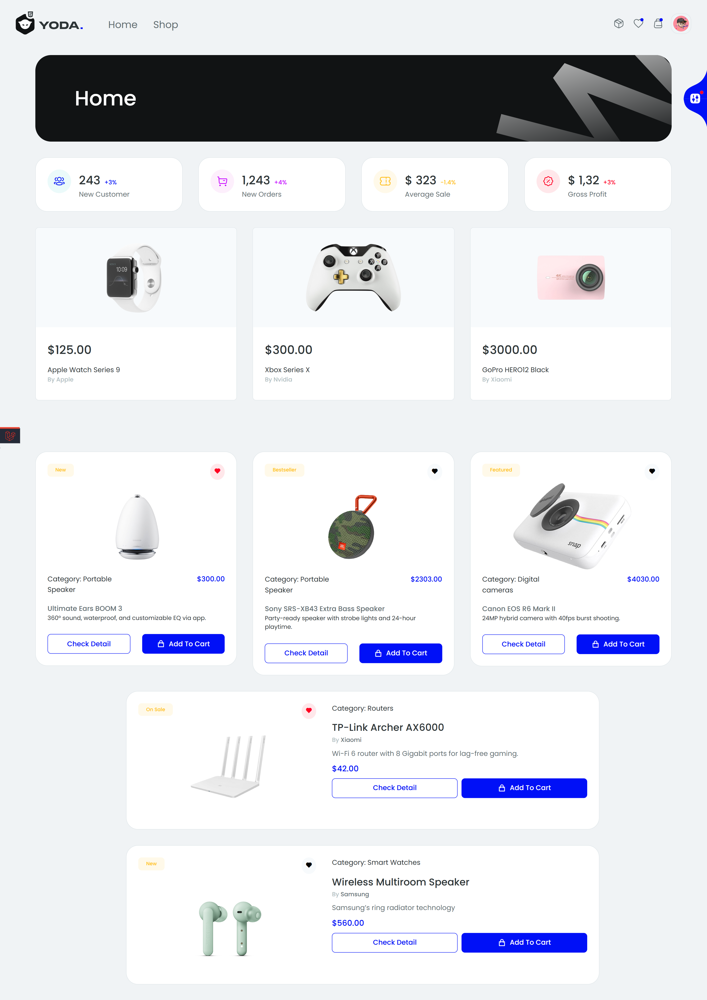

### Shop
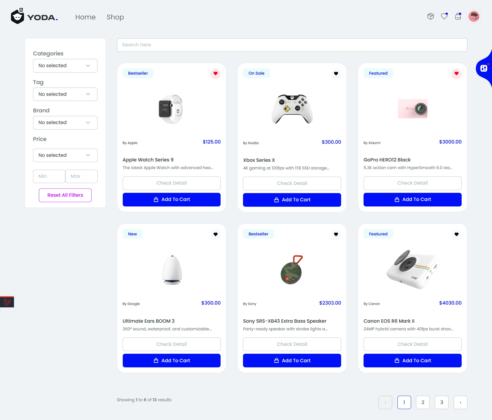

### Product Detail
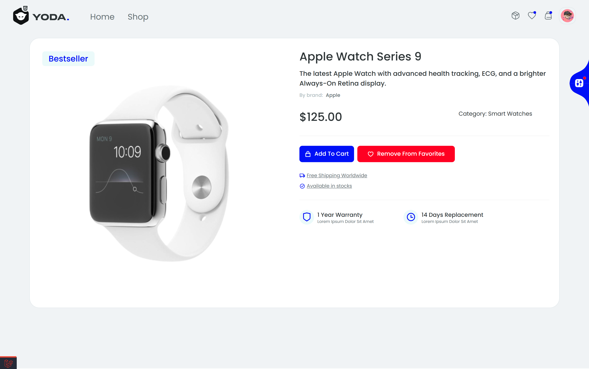

### Админ-панель
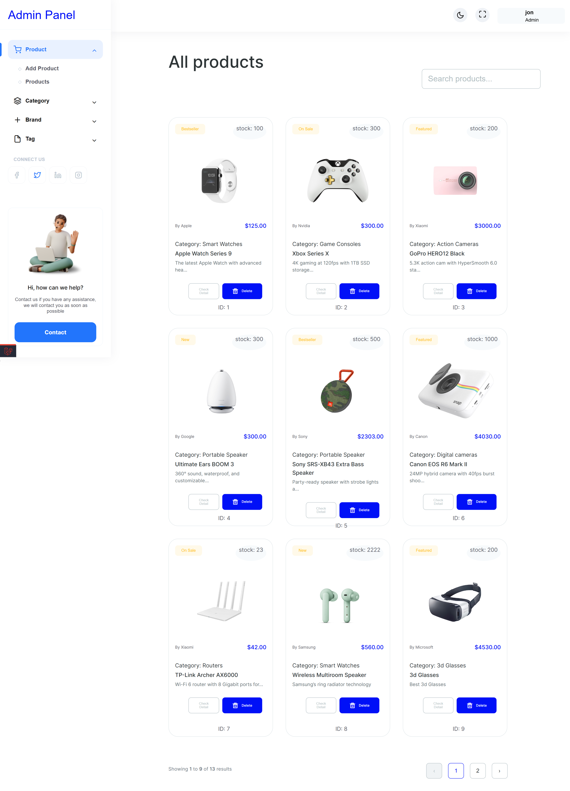

### My Cart
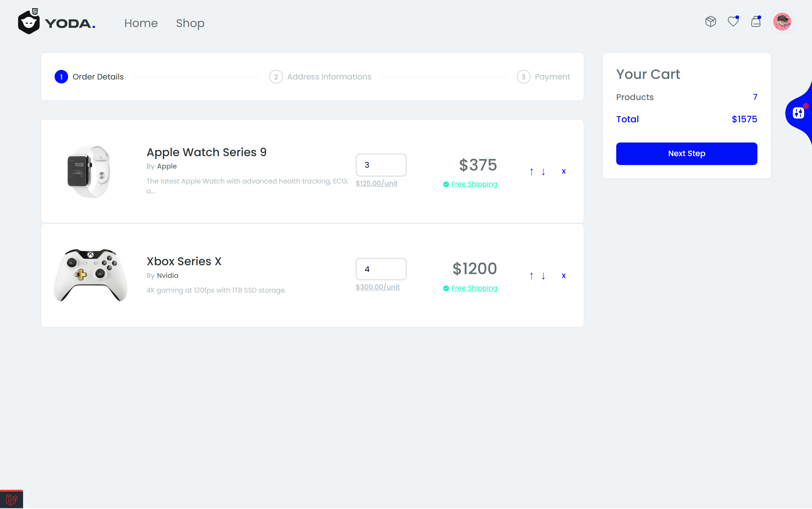

### Order Checkout
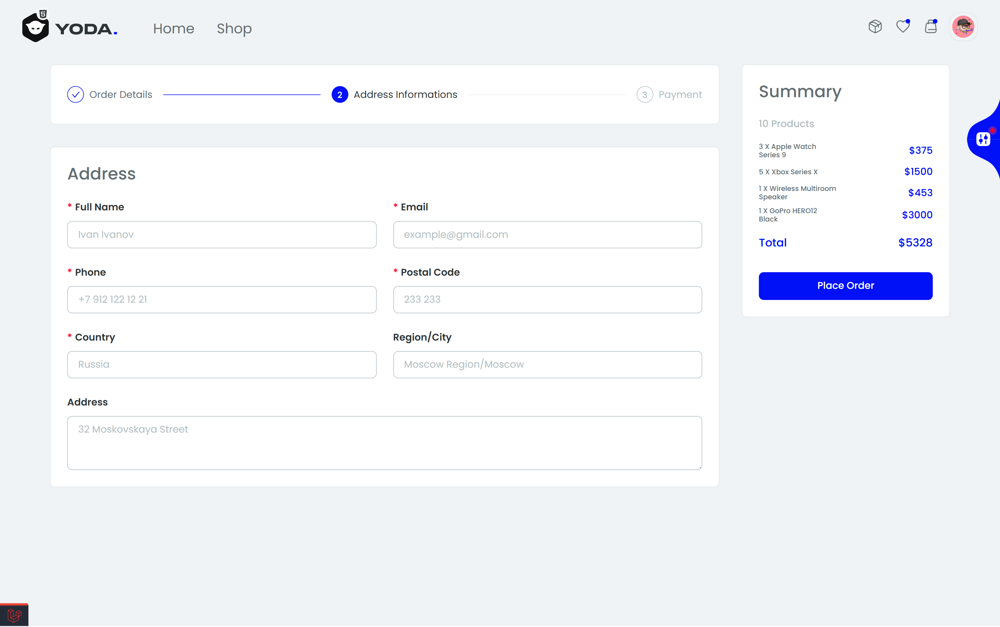

### My Orders
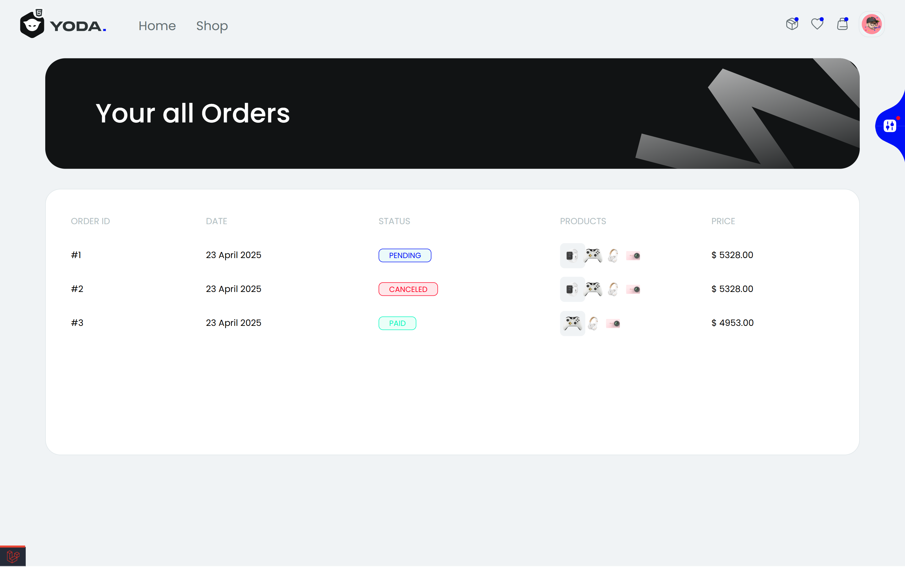

### Order Detail
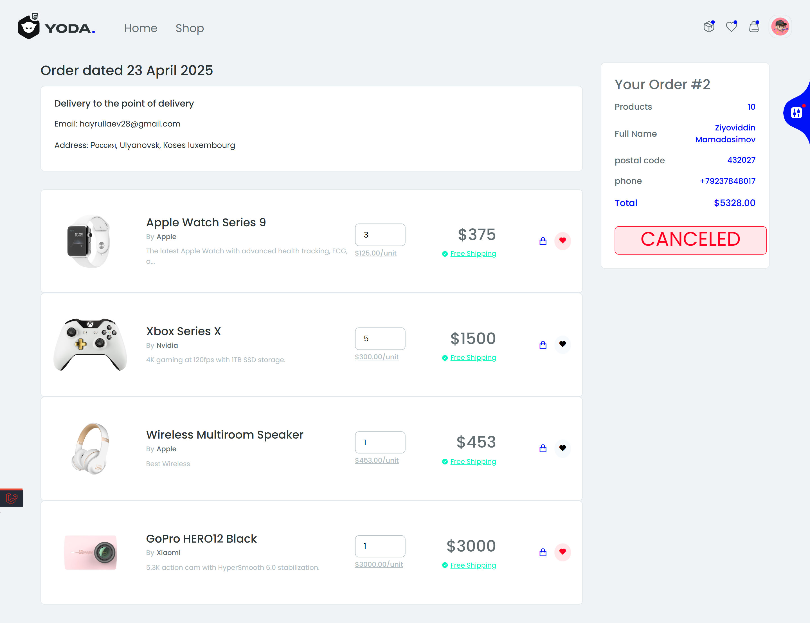

### Login and Register
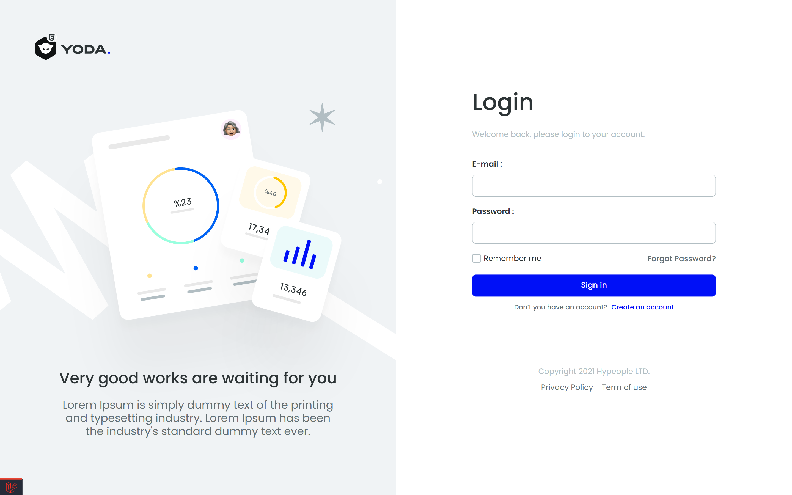
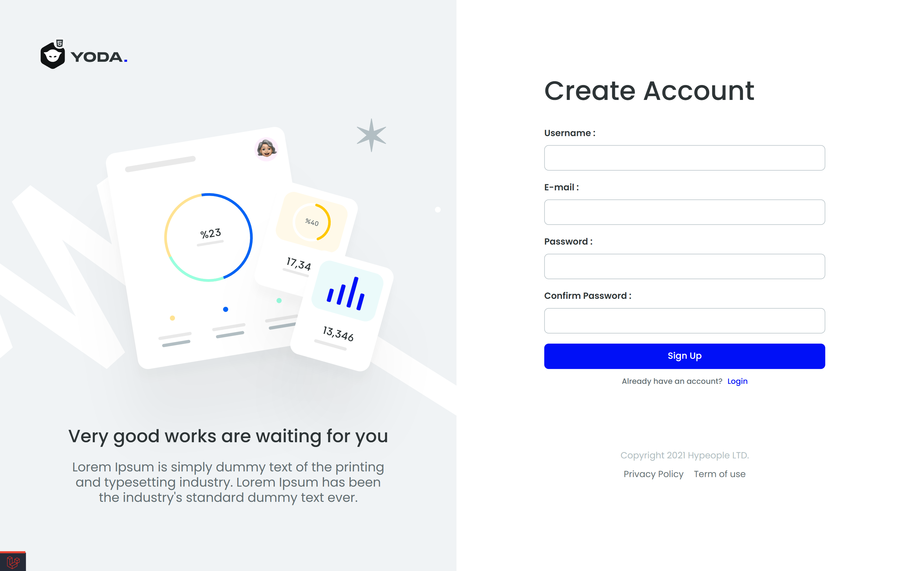

### Reset Password


### Admin Product Create
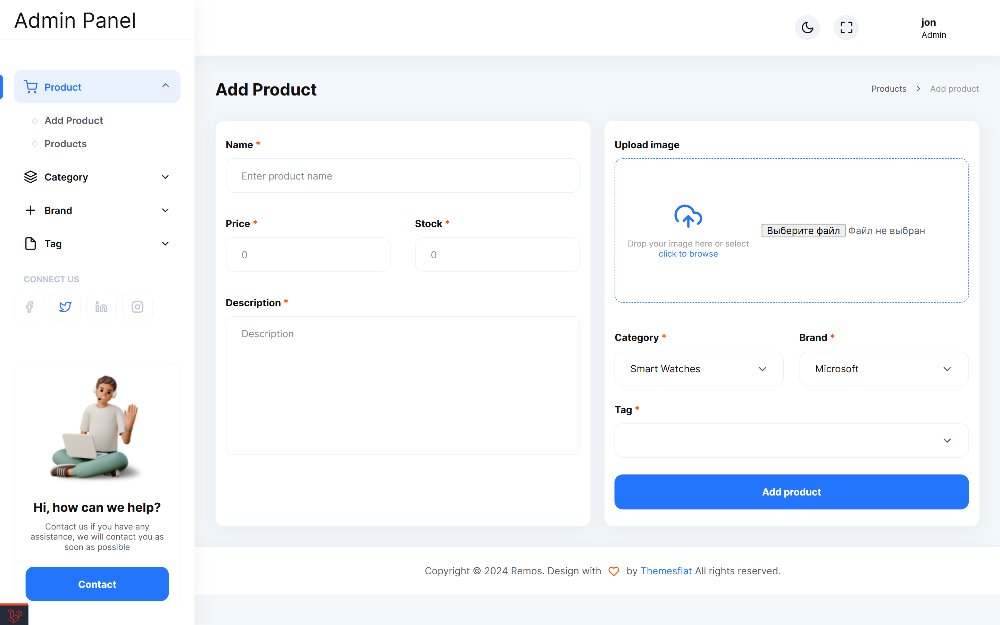

### My favorites
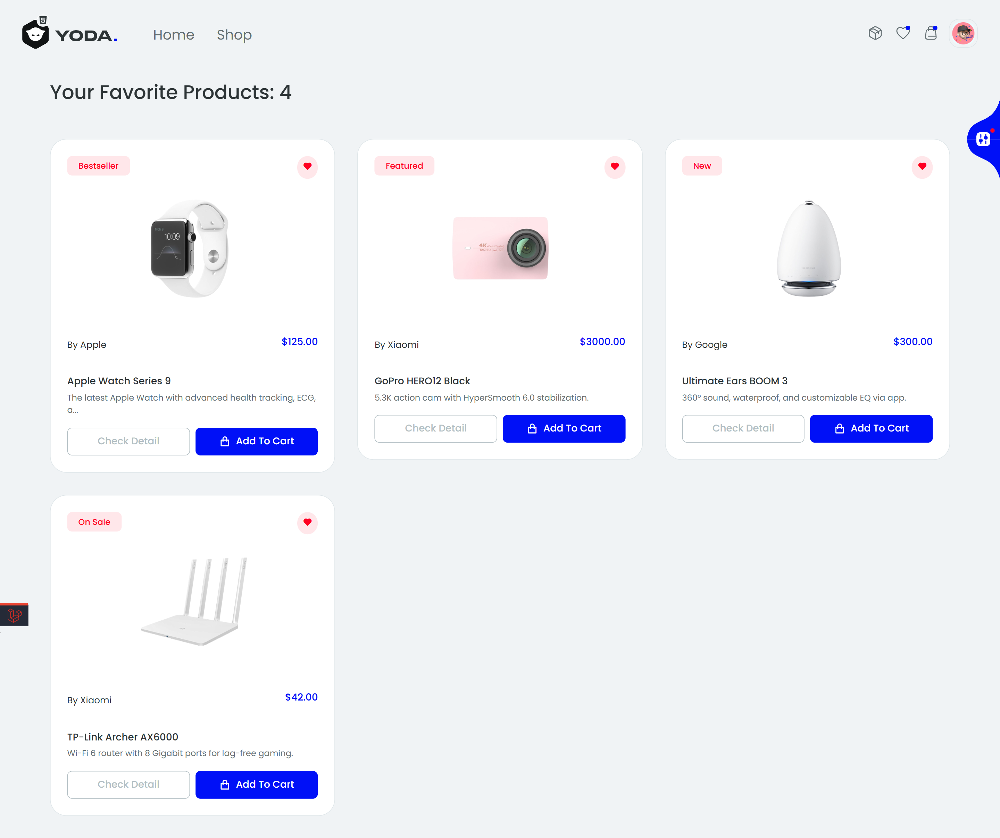

### Admin Categories
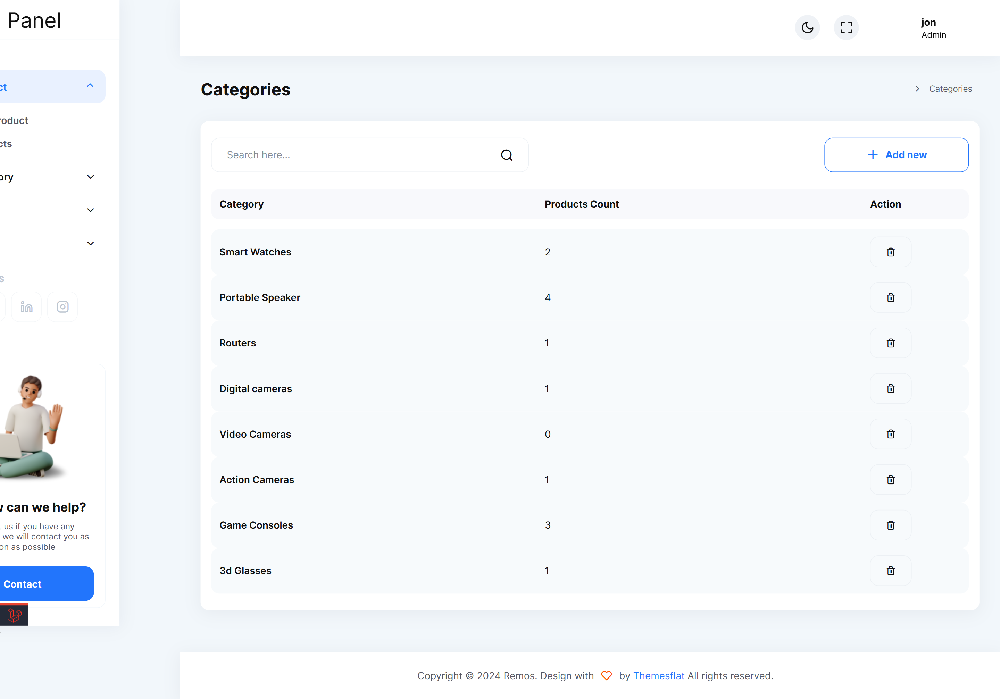
